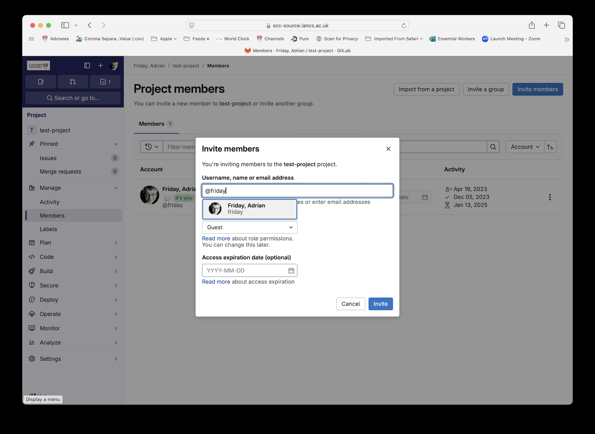

# Lab 1

## Submission checklist

- [ ] Ensure that you've created **a private** git repository (I recommend cloning my template: [https://scc-source.lancs.ac.uk/friday/scc243-labs.git](https://scc-source.lancs.ac.uk/friday/scc243-labs.git))
- [ ] From the scc-source gitlab web interface, go to 'Manage' then 'Members' and 'invite members' (button), add `@friday`

- [ ] Complete the [task for today](week1-task.md), ensure that you've added any documents you create to this folder [in markdown format](https://www.markdownguide.org/getting-started/)
- [ ] Make sure you remember to '`git add`' any new files you create
- [ ] `Git commit` and `push` your work to the repo, you can update this at any time
